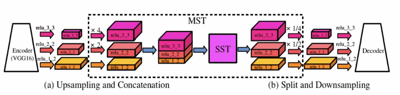
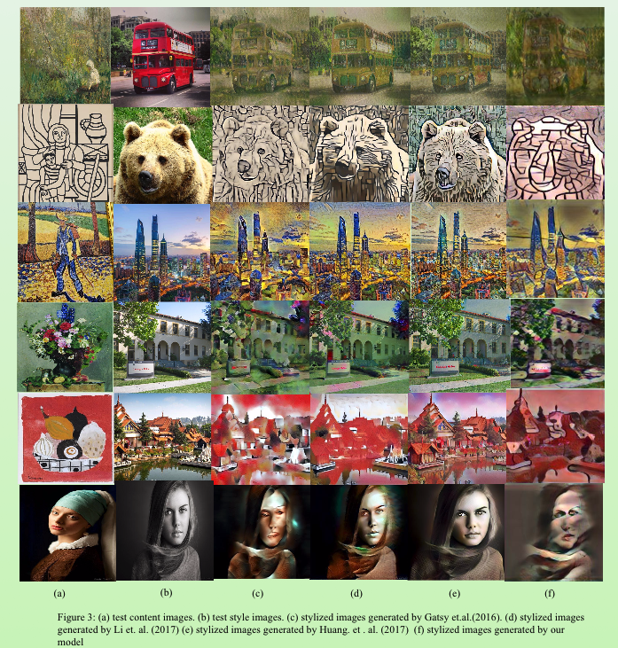

# Total-Style-Transfer

## CMU-11785-18Fall Final Project
### ICLR Reproducibility Challenge 2019

Target paper: [Total Style Transfer with a Single Feed-Forward Network](https://openreview.net/forum?id=BJ4AFsRcFQ)

### Related Works
-   [Image Style Transfer Using Convolutional Neural Networks](https://www.cv-foundation.org/openaccess/content_cvpr_2016/papers/Gatys_Image_Style_Transfer_CVPR_2016_paper.pdf)
    Above paper has good performance but required **training time** for each generated image
-   [Universal Style Transfer via Feature Transforms](https://arxiv.org/pdf/1705.08086.pdf)
    Above paper can generate arbitrary style&content image pair with one-pass feed forward. But it's **cascade** structure require a bit larger computation
-   [Arbitrary Style Transfer in Real-time with Adaptive Instance Normalization](https://arxiv.org/pdf/1703.06868.pdf)
    Introduced well performance transform

### Method
We basically follow the structure of target paper, and try to reproduce the result.

The encoder and decoder pair is a mirror connected VGG-16 with pre-trained weights from ImageNet

The paper consider inter-scale & intra-scale features which is a new perspective.

For the MST, we extract multi-scale content & style features from relu1_2, relu2_2, relu3_3 layers of encoder, upsample and concatenate them into one tensor. 

Flatten the height & width dimension into one dimension, and zero centor that specific dimension. 

At first, we try to normalize the zero center matrix by its covariance matrix. Then, we apply normalization of zero center matrix using its standard deviation along flatten dimension. 

After that, we scale the normalized matrix with style’s standard deviation along flatten dimension and also add style’s flatten dimension mean matrix to get the transform result.

After finishing transform of concatenated tensor, we divided and downsampled the result, and feed relative result into decoder to generate stylized image. We also used skip-connection to improve the result

Loss function consider content loss and one of inter-scale & intra-scale loss. Optimizer is Adam.

### Result
